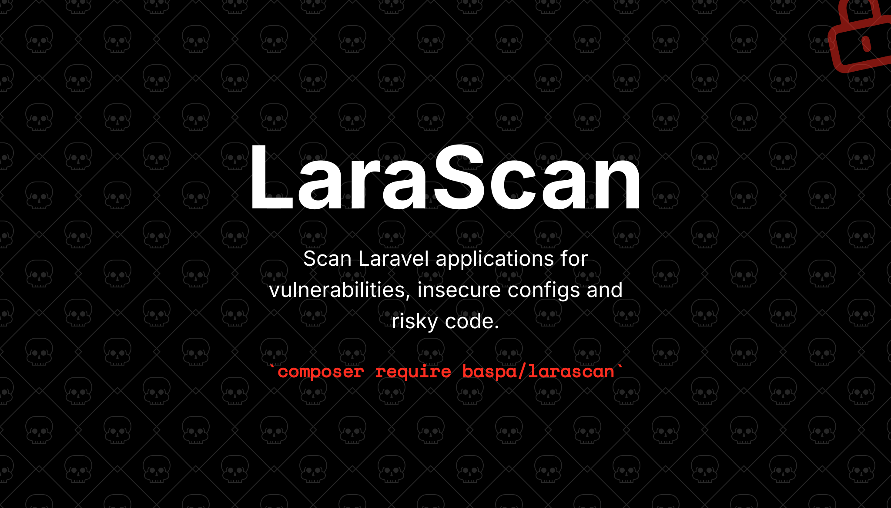

<p align="center">
    
</p>

# LaraScan

Security-focused static analysis for Laravel applications. One artisan command, ~70 checks across config, cookies, headers, auth, models, SQL, XSS, files, injection, crypto, dependencies and more.

> **Status:** v1.0 ready — 70 checks across 15 categories, PHPStan level 8, supports Laravel 10/11/12/13. See [CHANGELOG.md](CHANGELOG.md) for the v1.0 release notes.

## Install

```bash
composer require baspa/larascan --dev
php artisan larascan:install
```

## Usage

```bash
php artisan larascan                  # run all enabled checks
php artisan larascan --category=config
php artisan larascan --fail-on=high   # CI threshold
php artisan larascan:list             # list registered checks
```

### Output formats

| Flag | Default for | Description |
|---|---|---|
| (none) | TTY / humans | Colored Enlightn-style output: categorized checks with a report card at the end |
| `--format=json` | AI agents | Structured JSON. Auto-selected when `laravel/agent-detector` flags the run as an agent. |

When an AI agent runs larascan (detected via `laravel/agent-detector` — Claude Code, Cursor, Codex, Gemini CLI, Copilot, etc.), JSON is the default. Force it with `LARASCAN_AGENT_MODE=1`.

After installing, the following checks are available by default:

**Config (`config.*`)**
- `config.app-debug` — APP_DEBUG must be false in production
- `config.app-key` — APP_KEY must be set
- `config.app-env` — APP_ENV must not be a development value in production
- `config.env-not-committed` — .env must be gitignored and never committed
- `config.env-example-sync` — .env and .env.example must share key sets
- `config.env-calls-outside-config` — env() calls outside config/ defeat config caching
- `config.log-level` — Default log channel must not be at debug in production
- `config.debug-blacklist` — debug_blacklist must redact sensitive env keys when debug is on
- `config.trusted-proxies` — Trusted proxies must not be wildcard

**Cookies & sessions (`cookies.*`)**
- `cookies.session-secure` — SESSION_SECURE_COOKIE must be true in production
- `cookies.session-http-only` — SESSION_HTTP_ONLY must be true
- `cookies.session-same-site` — SESSION_SAME_SITE must be lax or strict
- `cookies.session-encrypt` — session.encrypt should be true
- `cookies.session-lifetime` — session.lifetime must be within a reasonable range
- `cookies.encrypt-middleware` — EncryptCookies middleware must be registered
- `cookies.encrypt-excludes` — Sensitive cookies must not be in EncryptCookies::$except

**Headers (`headers.*`)**
- `headers.cors-wildcard` — CORS allowed_origins must not be wildcard with credentials enabled
- `headers.hsts` — HSTS header middleware must be active in production
- `headers.x-content-type-options` — X-Content-Type-Options: nosniff middleware must be active
- `headers.x-frame-options` — X-Frame-Options or frame-ancestors must be set
- `headers.referrer-policy` — Referrer-Policy header middleware should be active
- `headers.csp-defined` — CSP middleware must be active (requires `spatie/laravel-csp`)
- `headers.csp-unsafe-inline` — CSP must not use unsafe-inline or unsafe-eval (requires `spatie/laravel-csp`)

**Auth (`auth.*`)**
- `auth.bcrypt-rounds` — BCRYPT_ROUNDS must be 12 or higher
- `auth.sanctum-expiration` — Sanctum tokens must have an expiration (requires `laravel/sanctum`)
- `auth.login-throttle` — Login routes must have throttle middleware
- `auth.password-column-plain` — User model must hide or hash the password column
- `auth.signed-routes-verify` — Email verification routes must use signed middleware
- `auth.api-ability-scoping` — Sanctum tokens must be created with explicit abilities (requires `laravel/sanctum`)

**CSRF (`csrf.*`)**
- `csrf.middleware-disabled` — VerifyCsrfToken middleware must be registered
- `csrf.except-suspicious` — CSRF except list must not contain wildcard patterns

**Models (`models.*`)**
- `models.unguarded` — Eloquent models must not use `$guarded = []`
- `models.unguard-call` — No static `Model::unguard()` calls in application code
- `models.foreign-key-fillable` — Foreign key columns should not be in `$fillable`
- `models.force-fill-user-input` — `forceFill()` calls bypass mass-assignment protection

**PHP (`php.*`)**
- `php.expose-php` — expose_php must be off
- `php.display-errors` — display_errors must be off in production
- `php.allow-url-fopen` — allow_url_fopen should be off
- `php.public-sensitive-files` — No .env / .git / .sql backups in public/
- `php.phpinfo` — No phpinfo() calls in application code

**Logging (`logging.*`)**
- `logging.dd-dump-debug` — No dd() / dump() / var_dump() in application code
- `logging.custom-error-pages` — resources/views/errors/500.blade.php and 503.blade.php must exist
- `logging.sensitive-in-log-context` — Log context arrays must not contain password/token/secret keys

**Repo & CI (`repo.*`)**
- `repo.dependabot` — .github/dependabot.yml should exist for automated dep updates
- `repo.gitleaks-history` — No high-entropy secrets in git history (last 100 commits)
- `repo.debug-toolbars` — Debug packages (debugbar, telescope) must be in require-dev only

**XSS (`xss.*`)**
- `xss.blade-unescaped` — Blade {!! $var !!} with PHP variables risks XSS
- `xss.html-string` — Illuminate\Support\HtmlString produces unescaped HTML
- `xss.url-javascript-protocol` — javascript: URLs in href/src are XSS sinks

**Files (`files.*`)**
- `files.path-traversal` — Storage/File operations with user-controlled paths
- `files.unlink-user-input` — unlink()/rmdir() in application code
- `files.upload-mimes-validation` — Validation by extension rather than MIME
- `files.public-executable-uploads` — Upload rules allowing .php/.phtml/.phar

**Injection (`injection.*`)**
- `injection.command` — exec/shell_exec/system/passthru calls
- `injection.process-shell` — Process::fromShellCommandline() usage
- `injection.unserialize` — unserialize() of any input
- `injection.open-redirect` — redirect() with user-controlled URL
- `injection.host-header` — app.url missing or pointing to localhost

**Crypto & secrets (`crypto.*`)**
- `crypto.weak-hash` — md5/sha1 for security purposes
- `crypto.weak-random` — rand/mt_rand/uniqid for security tokens
- `crypto.cipher-not-pinned` — config/app.php does not pin the cipher
- `crypto.hardcoded-secret` — High-entropy secrets or known token patterns in code

**SQL (`sql.*`)**
- `sql.raw-user-input` — DB::raw / whereRaw / selectRaw with user input
- `sql.raw-order-by` — orderByRaw with user input
- `sql.variable-table-column` — Variable arguments to DB::table / from / select
- `sql.validation-rule-injection` — Validation rules from variable source

**Dependencies (`dependencies.*`)**
- `dependencies.composer-audit` — wraps `composer audit` for PHP CVE detection
- `dependencies.npm-audit` — wraps `npm audit` when a `package.json` is present
- `dependencies.minimum-stability-dev` — composer.json minimum-stability is 'dev' without prefer-stable
- `dependencies.outdated-php` — PHP version at or near end-of-life

## Documentation

- [Design spec](docs/superpowers/specs/2026-05-15-larascan-design.md)
- Per-check documentation lives under `docs/checks/` (added in Phase 7).

## Requirements

- PHP 8.2+
- Laravel 10 / 11 / 12 / 13

## License

MIT
